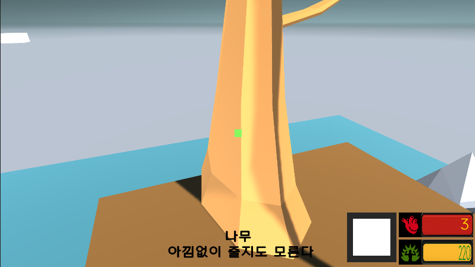

# my-3D-The_Jumping_Dungeon
3D로 구현한 점프맵 출구를 향해 무한점프하세요!

기본 스텟 : 체력(3), 스테미나(220), 아이템[E], 카메라 전환[Q]

목표까지의 남은 거리 (좌측 상단)
 

장애물에 부딪힐시 체력감소

마우스를 가져다 대면 무엇인지 판별해줍니다. (장식물도 있음)

## 개발 도구
Unity 버전 2022.3.17f1

주 언어 : C#

## 기능
W A S D : 이동

스페이스 바 : 점프 (스테미나 220 이상시 가능)

E : 아이템 사용 

(회복아이템) (즉발)

Q : 카메라 전환

## 규칙
|이름|케이스|부가설명|
|----|---|------|
|클래스, 메서드| 파스칼 | 첫 글자 대문자|
|변수  | 카멜 | 첫 글자 소문자 이후 대문자|
|private 변수| 스네이크| _이후 소문자 _이후 대문자|

### commit
[Docs] 문서 정리

[Fix] 버그 해결

[Feat] 그외의 작업

## 에셋

https://assetstore.unity.com/packages/3d/environments/historic/medieval-bridge-3d-67509
